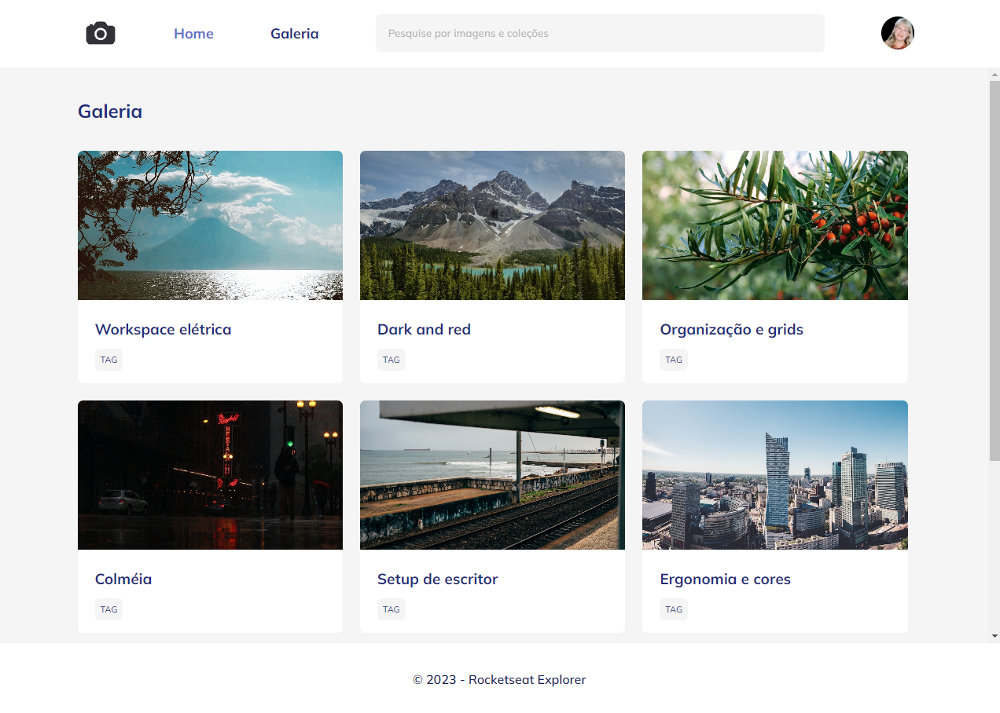

# GALAXIES 
### Projeto05-Stage03

 

> Trilha Explorer

### Projeto desenvolvido durante as aulas do Módulo 05, referente ao Stage 03, do curso da Rocketseat.

Novo projeto desenvolvido aplicando os conceitos de animações, transições entre outros:
- Estrutura em grid com header e footer fixos 
- Variáveis CSS
- Font customizadas
- Formulário de pesquisa com boas práticas de acessibilidade
- Alteração das cores do site de maneira dinâmica utilizando variável
- Aplicando animações usando as keyframes.

 

  

## 🚀 Tecnologias

Esse projeto foi desenvolvido com as seguintes tecnologias:

- HTML
- CSS
- Git e Github

 

## Contato: gisellemacedo.dev@gmail.com

 
 

<h3 align="center">Feito com 💜 by Giselle</h3>